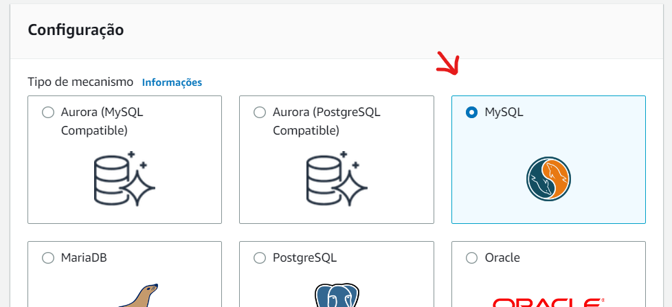
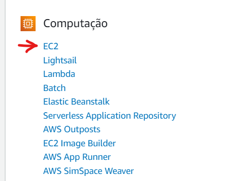

# Passos para instalação do Nodejs e MySQL no AWS


- verificar a região que vai criar o servidor, isso é importante para não criar um servidor em uma região e banco em outro, pois para conectar as 2 instâncias sem custo, precisa estar na mesma região. Esta opção fica no topo, no lado direito, selecione para "São Paulo (sa-east-1)".


## Criando banco MySQL
- Precisamos criar primeiro o banco de dados, na página home, selecione a opção "Ver todos os serviços" > Banco de dados > RDS


- Verifique antes a região antes de criar o banco


- Siga os passo para criar o banco:


o nível gratuito (Free tier) pode ser consultado o quanto foi usado na sua conta > faturamento > Free tier

(1) - o nome que vai ficar no começo da url, usado para string de conexão
<br>
(2) - usuário do banco, usado para string de conexão
<br>
(3) - senha do usuário, usado para string de conexão


- Aguarde o status mudar de (Criando) para (Disponível)


## Criando servidor NodeJS
- Para criar um servidor (ubuntu), na página home, selecione a opção "Ver todos os serviços" > Computação > EC2


- verifique antes se a região é a mesma do banco de dados, depois clique no botão "Grupo de segurança"


- Precisamos liberar as portas 22 (ssh para acesso remoto) e 3333 (porta do nodejs)


- verifique antes se a região é a mesma do banco de dados, depois clique no botão "Executar instância"

- De um nome para sua instância

- Selecione a imagem do Ubuntu. Verifique se está usando uma imagem gratuita

- Verifique se o tipo é gratuito

- Para acessar remoto, precisa de uma chave SSH, usa fica no servidor (já vai o arquivo automático para instância) e outra no seu computador (depois de criar, vai fazer o download pro seu computador)

- Insira o nome da chave (esse nova vai ficar no arquivo que você vai baixar), selecione o tipo "RSA" e formato ".pem"

- Selecione a mesma VPC que foi configurada no RDS (default)

- Clique no botão "Executar instância"

- Nesta tela os links abrem em nova aba. (1) verifique se sua nova instância está com estado de "Executando". (2) siga os passo para conectar via ssh

- Abra o terminal no seu computador, entre no diretório que está o arquivo da chave SSH, cole o comando para conectar via SSH


<br>
<br>

## Conectando um RDS com um EC2

- Acesse o menu Serviços > RDS > Recursos > Instâncias de banco de dados > nome-database > Recursos de computação conectados (ultima opção) > Configurar conexão do EC2
 - Selecione uma "Instância do EC2" e clique no botão "continuar" e na próxima tela clique no botão "confirmar e configurar"
 - Aguarde a configuração terminar antes de continuar

<br>
<br>

 ## Configurando Ubuntu (remoto no EC2)

- Rode os seguintes comando no seu terminal conectado via SSH

**Atualizando os pacotes**
```
sudo apt update && sudo apt upgrade -y
```

**Adicionando repositório do NodeJS**
```
curl -fsSL https://deb.nodesource.com/setup_18.x | sudo -E bash -
```

**Instalando o NodeJS**
```
sudo apt install -y nodejs
```

**Atualizando NPM**
```
sudo npm install -g npm
```

**Isntalando pacote para conectar MySQL**
```
sudo apt install -y mariadb-client
```

**Conectando no servidor MySQL**
<br>
_depois deste comando, informe a senha_
```
mysql -h database-api.cybcusxf5rma.sa-east-1.rds.amazonaws.com -P 3306 -u admin -p
```

**Criando a base de dados**
```
CREATE DATABASE apiTSdb;
```

**Saindo da conexão com o MySQL**
```
exit
```

**Clonando projeto via git**
```
git clone https://github.com/Lear-Skills/api2-lear.git
```

**Entrando na pasta do projeto**
```
cd api2-lear/
```

**Instalando pacotes via NPM**
```
npm install
```

**Editando a conexão com o MySQL**
<br>
_depois de editar, use as teclas "ctrl + x" para sair da edição e aperte "y" para confirmar_
```
nano src/db/conn.ts
```

**Força as permisões nas pastas antes de compilar**
```
sudo chmod 777 -R *
```

**Compilando o projeto**
```
npm run build
```

**Instalando pacote para continuar rodando node como serviço**
```
sudo npm install pm2 -g
```

**Executar o projeto (como serviço)**
```
pm2 start ~/api2-lear/dist/index.js --name=api-lear
```

